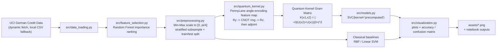
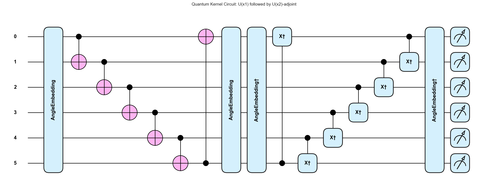
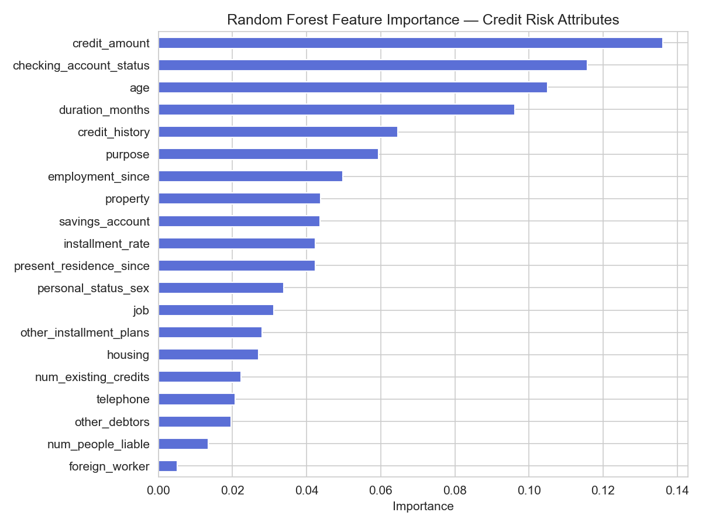
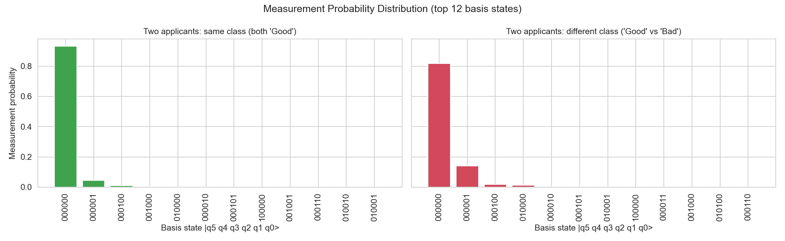
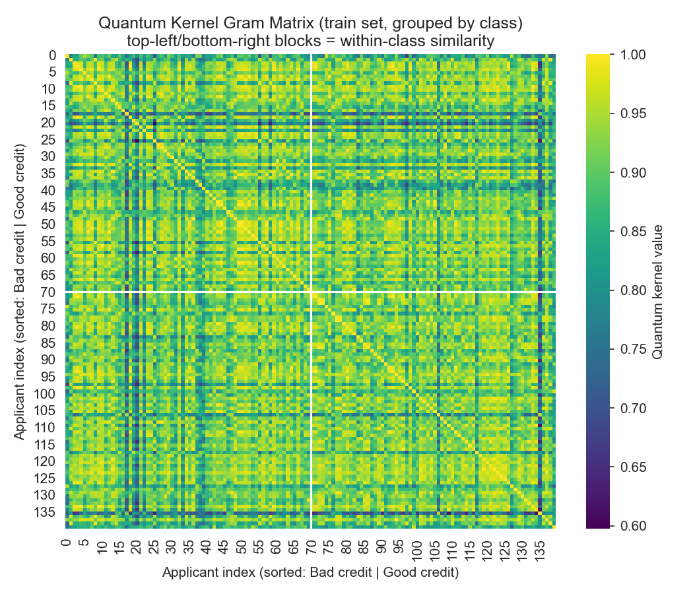
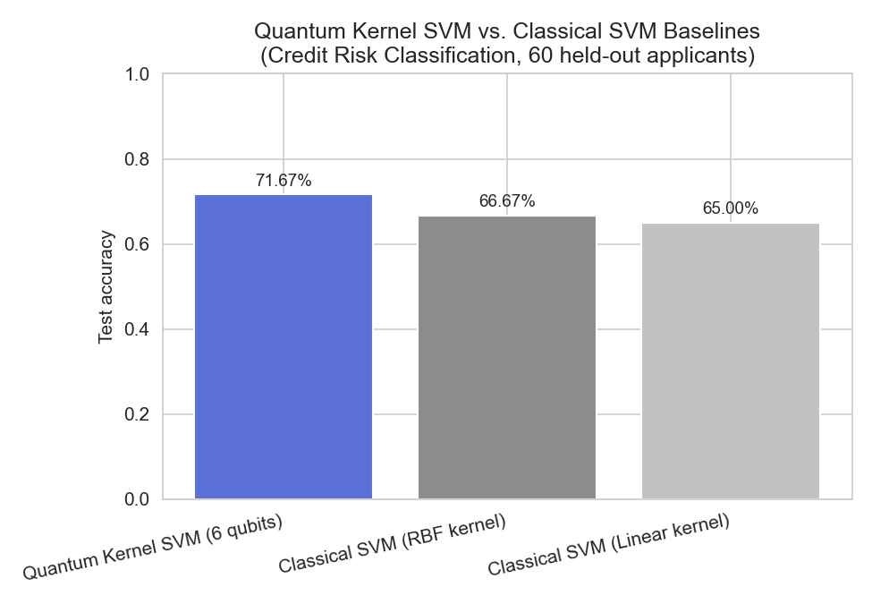
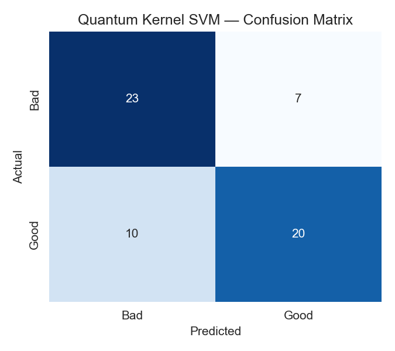

# Quantum Kernel Method for Credit Risk Scoring


A quantum machine learning approach to **credit risk scoring / loan-default classification**, built for the *Quantum Machine Learning. A 6-qubit fidelity quantum kernel (angle encoding + entangling CNOT ring) is estimated on a PennyLane simulator and used to train a kernel-based SVM, benchmarked against classical RBF and linear SVM baselines on the same data.

Runnable analysis: [`CreditRiskScoring_Loan_DefaultClassification.ipynb`](CreditRiskScoring_Loan_DefaultClassification.ipynb).

## Overview

Credit risk scoring classifies a loan applicant as *good* or *bad* credit risk from a high-dimensional, correlated financial profile — a setting where classical kernel methods pay an increasingly steep computational cost as feature interactions grow. This project encodes 6 Random-Forest-selected features into a 6-qubit quantum feature map and estimates pairwise sample similarity as a fidelity (state-overlap) kernel, computed directly from measurement statistics instead of an explicit feature-space calculation, then feeds that kernel into a standard SVM.

## Architecture



Each pipeline stage lives in its own module under [`src/`](src/), and the notebook is a thin orchestrator that imports and calls into them — the same functions are covered by the unit tests in [`tests/`](tests/) and re-executed headlessly in CI.

## Repository structure

```
.
├── CreditRiskScoring_Loan_DefaultClassification.ipynb   # end-to-end analysis notebook
├── src/
│   ├── config.py             # qubit budget, encoding range, paths, random seed
│   ├── data_loading.py       # UCI dynamic fetch + local CSV fallback
│   ├── feature_selection.py  # Random Forest feature ranking / top-k selection
│   ├── preprocessing.py      # scaling, stratified subsampling, train/test split
│   ├── quantum_kernel.py     # PennyLane feature map + fidelity kernel + Gram matrix
│   ├── models.py             # quantum/classical SVM training + evaluation
│   └── visualization.py      # all plotting functions
├── tests/                    # pytest unit tests, one file per src/ module
├── data/german_credit_data.csv   # bundled offline fallback copy of the dataset
├── assets/                   # generated plots (see Results below)
├── .github/workflows/ci.yml  # lint + test + notebook smoke-test pipeline
├── requirements.txt          # runtime dependencies
└── requirements-dev.txt      # + pytest, ruff, nbconvert, ipykernel
```

## Dataset

[Statlog German Credit Data](https://archive.ics.uci.edu/dataset/144/statlog+german+credit+data) (UCI ML Repository, id 144) — 1000 loan applicants, 20 attributes, binary target (700 good / 300 bad credit).

`src/data_loading.py` fetches this **dynamically** from UCI via the `ucimlrepo` client by default (categorical attributes are ordinally encoded, target recoded to `1 = good / 0 = bad`), and falls back automatically to the bundled `data/german_credit_data.csv` if the network or package is unavailable:

```python
load_credit_data()                     # dynamic UCI fetch (default)
load_credit_data(prefer_dynamic=False) # force the local CSV
```

> Categorical encoding differs slightly between the two sources, so exact metrics can drift a point or two depending on which one a given run used — the report PDF's numbers were generated from the local CSV fallback.

## Quantum model

- **Feature map** — 6 selected features are Min-Max scaled to `[0, π/4]` and angle-encoded: `Ry` rotations, a ring of CNOTs (`q0→q1→…→q5→q0`) for entanglement, then `Rz` rotations.
- **Kernel estimation** — apply `U(x1)` then `U(x2)†` to `|000000⟩` and read the probability of measuring the all-zero state: `K(x1,x2) = |⟨0|U(x2)†U(x1)|0⟩|² = |⟨φ(x2)|φ(x1)⟩|²`.
- **Simulator** — PennyLane `default.qubit`, exact statevector (no shot noise).

<p align="center"></p>

## Results

Feature selection ranks all 20 raw attributes with a classical Random Forest and keeps the top 6 for encoding:

<p align="center"></p>

The fidelity kernel concentrates more probability mass on the all-zero outcome for same-class applicant pairs than for different-class pairs — the separating signal an SVM needs:

<p align="center"></p>

Grouping the 140×140 training Gram matrix by class reveals a mild within-class similarity block structure:

<p align="center"></p>

On a 140/60 stratified train/test split, the quantum kernel SVM is competitive with the classical baselines trained on the identical split:

<p align="center"></p>
<p align="center"></p>

| Model | Test Accuracy |
|---|---|
| Quantum Kernel SVM (6 qubits) | 70.0% |
| Classical SVM (RBF kernel) | 61.7% |
| Classical SVM (Linear kernel) | 70.0% |

This is a small-sample proof-of-concept, not a quantum-advantage claim — see the report's Discussion & Limitations section for the full caveats (kernel concentration, quadratic Gram-matrix scaling, NISQ noise sensitivity).

## Getting started

```bash
python -m venv .venv
.venv\Scripts\activate          # Windows; use `source .venv/bin/activate` on Linux/macOS
pip install -r requirements-dev.txt

# register a Jupyter kernel so the notebook can find these packages
python -m ipykernel install --user --name python3 --display-name "Python 3"
```

Then open [`CreditRiskScoring_Loan_DefaultClassification.ipynb`](CreditRiskScoring_Loan_DefaultClassification.ipynb) and run all cells (select the **Python 3** kernel you just registered).

## Testing & linting

```bash
ruff check src tests   # lint
pytest tests -v         # unit tests for every src/ module
```

## CI/CD

[`.github/workflows/ci.yml`](.github/workflows/ci.yml) runs on every push/PR to `main`:

1. install `requirements-dev.txt`
2. `ruff check` on `src/` and `tests/`
3. `pytest tests -v`
4. register a Jupyter kernel and execute the full notebook headlessly as an end-to-end smoke test
5. upload the executed notebook and `assets/` plots as a build artifact

There is no build/deploy stage — this project ships a research notebook and report, not a deployed service, so CI stops at "does the whole pipeline still run and produce correct results."

## References

1. Rebentrost, Mohseni & Lloyd (2014), *Quantum support vector machine for big data classification*, PRL 113(13).
2. Havlíček et al. (2019), *Supervised learning with quantum-enhanced feature spaces*, Nature 567.
3. Liu, Arunachalam & Temme (2021), *A rigorous and robust quantum speed-up in supervised machine learning*, Nature Physics 17.
4. Schuld & Killoran (2019), *Quantum machine learning in feature Hilbert spaces*, PRL 122(4).
5. [PennyLane — Quantum kernels and kernel-based training](https://pennylane.ai/qml/demos/tutorial_kernel_based_training).
6. Dua, D. & Graff, C. (2019). *Statlog (German Credit Data) Data Set*, UCI Machine Learning Repository.
